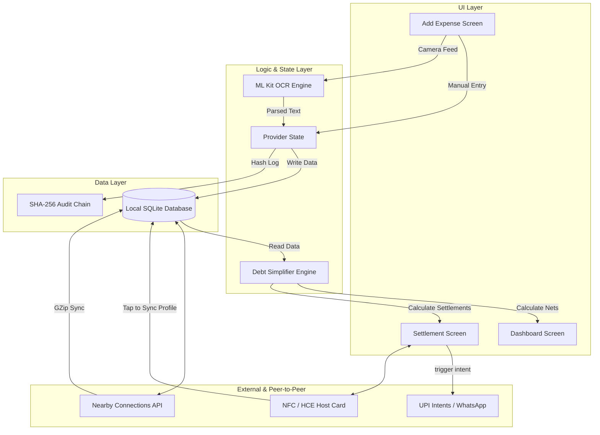

# QuickSplit

**Want to try it out?** Download the latest optimized APKs below:
* [📱 Download APK for ARM64 (Most Modern Phones)](https://github.com/kunjpatel007-gif/QuickSplit/raw/main/releases/app-arm64-v8a-release.apk)
* [📱 Download APK for ARM32 (Older Phones)](https://github.com/kunjpatel007-gif/QuickSplit/raw/main/releases/app-armeabi-v7a-release.apk)
* [💻 Download APK for x86_64 (Emulators)](https://github.com/kunjpatel007-gif/QuickSplit/raw/main/releases/app-x86_64-release.apk)


QuickSplit is an offline-first expense splitting app built for college campuses and friend groups. It handles shared expenses, peer-to-peer ledger syncing, and UPI settlements entirely on-device without needing a backend server.

The app is built with Flutter and uses a brutalist dark-mode UI.

## Table of Contents
* [Screenshots](#screenshots)
* [How It Works (Technical Breakdown)](#how-it-works-technical-breakdown)
  * [1. Offline-First Architecture](#1-offline-first-architecture)
  * [2. Peer-to-Peer Nearby Sync](#2-peer-to-peer-nearby-sync)
  * [3. Smart Debt Simplification](#3-smart-debt-simplification)
  * [4. NFC Tap-to-Sync (HCE)](#4-nfc-tap-to-sync-hce)
  * [5. ML-Powered Receipt Scanning](#5-ml-powered-receipt-scanning)
  * [6. Instant UPI Payments](#6-instant-upi-payments)
  * [7. Detailed Analytics](#7-detailed-analytics)
  * [8. Audit Log](#8-audit-log)
  * [9. WhatsApp Nudge](#9-whatsapp-nudge)
* [Getting Started](#getting-started)
* [Privacy](#privacy)
* [License](#license)

---

## Screenshots

<div align="center">
  
  &nbsp;&nbsp;&nbsp;
  
  &nbsp;&nbsp;&nbsp;
  
</div>
<br>
<div align="center">
  
  &nbsp;&nbsp;&nbsp;
  
  &nbsp;&nbsp;&nbsp;
  
</div>
<br>
<div align="center">
  
</div>

---


## Tech Stack & Libraries
* **Framework:** Flutter (Dart)
* **Database:** SQLite (`sqflite`)
* **State Management:** `provider`
* **Peer-to-Peer:** Google Nearby Connections (`nearby_connections`)
* **NFC / HCE:** `nfc_manager`
* **OCR & Vision:** Google ML Kit (`google_mlkit_text_recognition`)
* **Cryptography:** `crypto` (SHA-256 for Audit Log)
* **Deep Linking:** `url_launcher` (UPI and WhatsApp intents)
* **UI & Theming:** Material 3 (Brutalist Dark Theme)

---

## How It Works (Technical Breakdown)

### Data Flow & Architecture Diagram




### 1. Offline-First Architecture
* **Database:** Uses `sqflite` for a local SQLite database. Everything is saved to the device first.
* **State Management:** Powered by `Provider`. We don't rely on Firebase or AWS, so the UI updates instantly without waiting for network requests.
* **No Accounts:** The app doesn't require sign-ups or logins since all ledgers are isolated to the phone's storage.

### 2. Peer-to-Peer Nearby Sync
* **The API:** Uses Google's Nearby Connections API to discover phones over Bluetooth and Wi-Fi Direct.
* **Payload Compression:** Nearby Connections has a strict 32KB limit for byte payloads. QuickSplit bypasses this by serializing the entire SQLite ledger to JSON and running it through standard `GZip` compression before transmitting.
* **Merge Logic:** When a phone receives a payload, it unpacks the GZip, decodes the JSON, and does a bidirectional merge into its own local SQLite tables (ignoring exact duplicates).

### 3. Smart Debt Simplification
* **Graph Algorithm:** Instead of tracking messy A->B and B->C debts, the app runs a simplification algorithm. 
* **Net Balances:** It calculates the absolute net balance for every user. Then it sorts debtors and creditors, matching the person who owes the most with the person who is owed the most.
* **Fewer Transactions:** This mathematically guarantees the group settles up using the minimum number of transactions possible.

### 4. NFC Tap-to-Sync (HCE)
* **Host Card Emulation:** Uses the `nfc_manager` package to emulate a smart card.
* **Instant Pairing:** Instead of scanning QR codes to join a group, you just tap two Android phones together. The app broadcasts the QuickSplit User Profile via NFC, instantly adding them to your local database.
* **Instant Payments:** When settling a debt, tapping phones can also automatically extract the payee's UPI ID and instantly launch your UPI app (like GPay) with the payment ready to go.

### 5. ML-Powered Receipt Scanning
* **On-Device OCR:** Uses Google ML Kit Vision to read text directly from the camera feed. No images are sent to the cloud.
* **Custom Parser:** The raw text block is passed through a custom regex/NLP engine that scans for price patterns and item names to auto-fill the expense sheet.

### 6. Instant UPI Payments
* **Deep Linking:** Uses `url_launcher` to construct `upi://pay` intents.
* **Pre-filled Data:** When you hit "Pay", it launches Google Pay, PhonePe, or Paytm with the exact settlement amount and the receiver's UPI ID already filled in.

### 7. Detailed Analytics
* **Custom Rendering:** We built the pie charts and bar graphs from scratch using Flutter's `CustomPainter` API instead of heavy charting libraries. 
* **Live Queries:** Charts are drawn natively on the GPU by running direct queries against the local SQLite ledger to get category totals and 7-day rolling averages.

### 8. Audit Log
* **Blockchain-Style Verification:** Since there's no central server, we added a tamper-evident append-only log. Every expense creation, edit, or settlement is cryptographically chained using **SHA-256** hashing. Each entry references the previous hash (tracing all the way back to the Genesis block), making it mathematically impossible for any peer to silently rewrite financial history without breaking the chain.

### 9. WhatsApp Nudge
* **Quick Reminders:** If someone owes you money, tapping "Nudge" triggers a WhatsApp URL intent (`wa.me`) that opens their chat with a pre-typed reminder message.

---

## Getting Started

### Prerequisites
* Flutter SDK (3.24+)
* Android SDK 35+

### Running the App from Source
1. Clone the repository:
   ```bash
   git clone https://github.com/kunjpatel007-gif/QuickSplit.git
   ```
2. Fetch dependencies:
   ```bash
   flutter pub get
   ```
3. Run the app locally on a connected emulator or phone:
   ```bash
   flutter run
   ```

### Building and Installing APKs
We have a GitHub Actions workflow that automatically builds split APKs whenever you push to `main`. You can download the latest APKs from the Actions tab.

To manually build a release APK locally, run:
```bash
flutter build apk --split-per-abi --release
```
This generates ultra-optimized ARM APKs in your `build/app/outputs/flutter-apk/` directory.

To install the newly built APK onto a connected Android phone without erasing the local SQLite database, use adb:
```bash
adb install -r build/app/outputs/flutter-apk/app-arm64-v8a-release.apk
```

## Privacy
QuickSplit is completely offline. Your SQLite database stays on your phone. Data is only transmitted when you manually trigger a Nearby Sync with a friend or launch a UPI payment app. There are no tracking scripts or remote databases.

## License
[MIT License](LICENSE)


